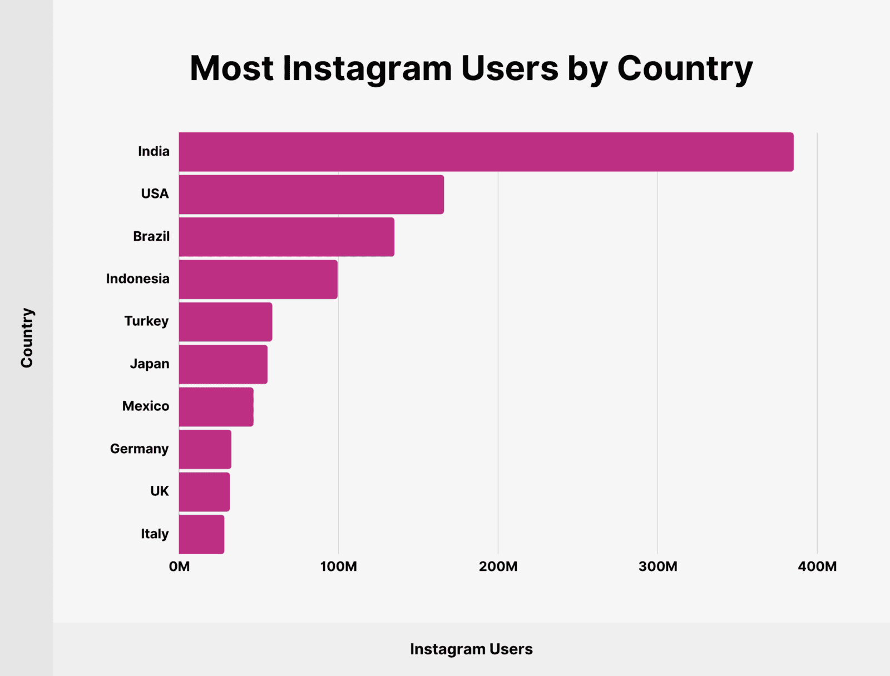

# Instagram
## Основная часть
### 1. Тема и целевая аудитория

**Instagram** - американская социальная сеть для обмена фотографиями и видео.
#### Функционал MVP
1. Регистрация и авторизация пользователей
2. Возможность загрузки фотографий, а также применения к ним фильтров
3. Комментирование фотографий другими пользователями
4. Возможность оценки фотографий (лайки)
5. Поиск авторов/пользователей
6. Возможность сохранять понравившиеся посты
7. Лента с постами от подписанных пользователей
8. Подписки на пользователей

#### Целевая аудитория

Метрики трафика и вовлеченности
1. MAU - **2B** [^3]
2. DAU - **500M** (по статистике за 2017 год) [^4]
3. Среднее время использования приложения в день - **34 минуты** [^4]
4. Каждый день на платформу загружается **>100M** фотографий [^2]
5. Средняя вовлеченность для постов в Instagram - **0.71%** [^1]

#### Распределение аудитории по странам [^4]

#### Средний возраст аудитории [^1]

### 2. Рассчет нагрузки
#### Предположения
Предположим, что средний пользователь Instagram видит примерно 150 постов в день, при нахождении в приложении **34 минуты** [^4].

В таком случае, при вовлеченности для одного поста в **0.71%** [^1] мы можем посчитать, что в среднем человек оставляет один лайк, комментарий, либо сохраняет один пост в избранное за день.

Также мы можем найти среднее процентное отношение лайков, комментариев и сохранений поста [^6]:

| Лайки | Комментарии | Сохранения |
| --- | --- | --- |
| 93.55% | 2.85% | 3.60% |

Тогда, при MAU в **500M** человек, каждый день оставляется примерно **467.8M** лайков, **14.25M** комментариев, а также **18M** сохранений постов.

##### Продуктовые метрики

| Метрика | Значение |
| --- | --- |
| MAU | **2B** [^3] |
| DAU | **500M** (по статистике за 2017 год) [^4] |
| Среднее время использования приложения в день | **34 минуты** [^4] |
| Каждый день на платформу загружается | **>100M** фотографий [^2] |
| Посещений instagram.com | **7.24B** [^5]|

##### Технические метрики

### Список использованных источников
[^1]: [Instagram users, stats, data & trends](https://datareportal.com/essential-instagram-stats)

[^2]: [Photo Statistics](https://www.linkedin.com/pulse/impact-instagram-50-statistics-you-should-know-2024-szhue#:~:text=Over%20100%20million%20photos%20and%20videos%20are%20uploaded%20to%20Instagram%20daily.)

[^3]: [Most popular social networks worldwide as of April 2024, by MAU](https://www.statista.com/statistics/272014/global-social-networks-ranked-by-number-of-users/)

[^4]: [BackLinko](https://backlinko.com/instagram-users)

[^5]: [semrush.com](https://www.semrush.com/website/instagram.com/overview/)

[^6]: [Instagram statistics](https://onlysocial.io/important-instagram-statistics/)
