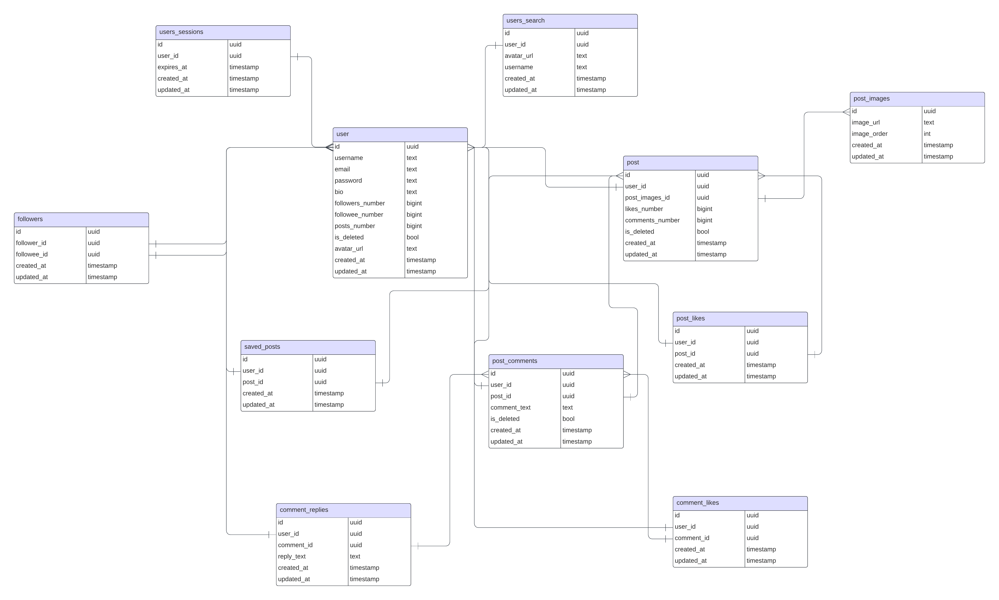

# Instagram

## Содержание
* [Instagram](#instagram)
   * [1. Тема и целевая аудитория](#1-тема-и-целевая-аудитория)
   * [2. Расчет нагрузки](#2-расчет-нагрузки)
   * [3. Расчет нагрузки](#3-расчет-нагрузки)
   * [4. Локальная балансировка нагрузки](#4-локальная-балансировка-нагрузки)
   * [5. Логическая схема БД](#5-логическая-схема-бд)
   * [6. Физическая схема БД](#6-физическая-схема-бд)
   * [7. Алгоритмы](#7-алгоритмы)
   * [8. Технологии](#8-технологии)
   * [9. Обеспечение надежности](#9-обеспечение-надежности)
   * [10. Схема проекта](#10-схема-проекта)
   * [Список использованных источников](#список-использованных-источников)

## Основная часть

## 1. Тема и целевая аудитория

**Instagram** - американская социальная сеть для обмена фотографиями и видео.

### Функционал MVP

1. Регистрация и авторизация пользователей

2. Возможность загрузки фотографий, а также применения к ним фильтров

3. Комментирование фотографий другими пользователями

4. Возможность оценки фотографий (лайки)

5. Поиск авторов/пользователей

6. Возможность сохранять понравившиеся посты

7. Лента с постами от подписанных пользователей

8. Подписки на пользователей

### Целевая аудитория

Метрики трафика и вовлеченности

1. MAU - **2B** [^3]

2. DAU - **500M** (по статистике за 2017 год) [^4]

3. Среднее время использования приложения в день - **34 минуты** [^4]

4. Каждый день на платформу загружается **100M** фотографий [^2]

5. Средняя вовлеченность для постов в Instagram - **0.71%** [^1]

### Распределение аудитории по странам [^9]

[](https://www.statista.com/statistics/578364/countries-with-most-instagram-users/)

### Средний возраст аудитории [^1]

[](https://datareportal.com/essential-instagram-stats)

## 2. Расчет нагрузки

### Предположения

Предположим, что средний пользователь Instagram видит примерно **150** постов в день, при нахождении в приложении 34 минуты [^4].

В таком случае, при вовлеченности для одного поста в **0.71%** [^1] мы можем посчитать, что в среднем пользователь взаимодействует с **1.07** постом за день.

Также, используя данные об усредненной статистике поста по окончании года, мы можем увидеть значения количества лайков, комментариев и сохранений[^6]:

| Лайки  | Комментарии | Сохранения |
|--------|-------------|------------|
| 513.37 | 15.66       | 19.79      |

Тогда, при MAU в **500M** человек, каждый день оставляется примерно **467.8M** лайков, **14.25M** комментариев, а также **18M** сохранений постов.

На основе абсолютных качений, рассчитаем отношение лайков к остальным показателям:

- Отношение лайков к комментариям - 33:1

- Отношение лайков к сохранениям - 26:1

### Расчеты

Из расчета, что Instagram приводит большинство фотографий к разрешению **1080p x 1080p** [^7], а также сжимает их в целях сохранения места получаем размер одной фотографии примерно в **500KB** [^8].Тогда, при **100M** загруженных фотографий в день, общий размер хранилища составляет **50TB** в день или **100KB** на пользователя.

Пусть средняя длина комментария - **60** символов, тогда в кодировке UTF-8 (для поддержки большинства языков и emoji) они занимают **0.24KB**. Тогда, при среднем дневном количестве комментариев в **14.25M**,всего нужно около **3.42GB** в день, или же **0.035KB** на пользователя в день.

Примем, что **1%** пользователей входят на сервис каждый день.

Из роста **MAU** с 1B до 2B с 2018 по 2022 год, мы можем рассчитать среднее количество регистраций в **700K** в день[^4].

Около **18%** постов в Instagram используют встроенный фильтр [^14], тогда примерно **1.8M** из **100M** фотографий каждый день загружается с фильтром.

### Действия пользователей

Используя данные по усредненной статистике поста, а также о взаимодействии с постами, можем рассчитать дневные действия пользователя:

| Действие пользователя            | Количество в день |
|----------------------------------|-------------------|
| Просмотр постов                  | 150               |
| Использование поиска             | 1(*)              |
| Загрузка фотографии              | 0.2               |
| Комментирование поста            | 0.03              |
| Отметка "нравится" для поста     | 0.94              |
| Сохранение поста в "избранное"   | 0.04              |
| Подписка на другого пользователя | 0.15(**)          |
| Вход                             | 0.01              |
| Регистрация                      | 0.0014            |
| Использование фильтров           | 0.036             |

(*) Приблизительно, на основе данных использования страницы **Explore**[^11].

(**) Приблизительно, на основе технического ограничения на дневное количество подписок[^12].

### Продуктовые метрики

| Метрика                                                        | Значение                                  |
|----------------------------------------------------------------|-------------------------------------------|
| MAU                                                            | **2B** [^3]                               |
| DAU                                                            | **500M** (по статистике за 2017 год) [^4] |
| Среднее время использования приложения в день                  | **34 минуты** [^4]                        |
| Каждый день на платформу загружается                           | **>100M** фотографий [^2]                 |
| Посещений instagram.com                                        | **7.24B** [^5]                            |
| Средний размер хранилища для фотографий на пользователя в день | **100KB**                                 |
| Средний размер комментария на пользователя в день              | **0.035KB**                               |
| Среднее количество фотографий на пользователя в день           | **0.2шт**                                 |
| Среднее количество комментариев на пользователя в день         | **0.03шт**                                |

### Технические метрики

#### Хранилища

| Тип хранилища | Размер в день | Размер в месяц |
|---------------|---------------|----------------|
| Фотографии    | **50TB**      | **1.5PB**      |
| Комментарии   | **3.42GB**    | **1TB**        |

#### Сетевой трафик

На каждую фотографию кидается запрос на сервер. При примерном количестве постов, которые видит один человек за день в **150**, он в среднем делает 150 запросов.Тогда, при DAU в **500M**, каждый день происходит **75B** запросов, или же **3.125B** в час, **52M** в минуту, **868K** в секунду.

Предположим, что к каждому **10-му посту** пользователь прочитает комментарии, и к одному его оставит, либо поставит лайк. При общем количестве этих действий в **15** запросов(один запрос на комментарий + **14** на просмотр, так как для нескольких постов пользователь пролистает их вниз, в связи с чем произойдет еще несколько запросов для загрузкипоследующих комментариев),при DAU в **500M** можем рассчитать дополнительное количество запросов в **7.5B** в день, **87K** в секунду.

Также предположим, что один запрос на получение комментариев возвращает батч на **5 штук**, общим весом в **1KB**.

Из среднего количества загруженных фотографий в день получаем, что в день **100M** запросов на загрузку, **1.2K** в секунду.

Предположим, что при поиске выдается **JSON** с несколькими результатами выдачи, общим размером **1KB**. Также предположим, что при подписке, а так же сохранении поста происходит запрос с **JSON** размером **20B**[^13].

Все фильтры для постов в Instagram работают локально на устройстве и не потребляют сетевой трафик[^14].

Предположим, что для регистрации и авторизации используются **JSON** с размерами **40B** и **20B**, соответственно.

| Тип                           | Средний RPS | Пиковый RPS(*) | Сетевой трафик (средний) | Сетевой трафик (пиковый) |
|-------------------------------|-------------|----------------|--------------------------|--------------------------|
| Просмотр поста                | 868K        | 1.7M           | 3.4Тбит/с                | 6.8Тбит/с                |
| Загрузка поста                | 1.2K        | 2.4K           | 4.8Гбит/s                | 9.6Гбит/s                |
| Открытие секции комментариев  | 81K         | 162K           | 650Mбит/с                | 1.2Гбит/с                |
| Оставление комментария        | 0.8K        | 1.6K           | 2Мбит/с                  | 4Мбит/с                  |
| Оставление отметки "Нравится" | 5.4K        | 10.8K          | 22Кбит/c                 | 44Кбит/с                 |
| Использование поиска          | 5.7K        | 11.4K          | 45.6Мбит/с               | 91.2Мбит/с               |
| Подписка на пользователя      | 1K          | 2K             | 160Кбит/с                | 320Кбит/с                |
| Сохранение поста              | 1K          | 2K             | 160Кбит/с                | 320Кбит/с                |
| Авторизация                   | 60          | 120            | 10Кбит/с                 | 20Кбит/с                 |
| Регистрация                   | 8           | 16             | 5Кбит/с                  | 10Кбит/с                 |
| Итого                         | 964K        | 1.9M           | 3.41 ТБит/с              | 6.82ТБит/с               |

(*) Считаем, что пиковый RPS в 2 раза больше среднего.

## 3. Расчет нагрузки

### Разбиение по доменам

Instagram использует один домен для основных страниц - **instagram.com**, а также некоторые дополнительные, для различных вспомогательных страниц, не рассматриваемых в **MVP** (например, [**help.instagram.com**](https://help.instagram.com)).

### Расположение датацентров

Исходя из данных о странах с самым большим количеством пользователей можем рассчитать следующее расположение датацентров:

1. Азия

   - Индия

     - Мумбаи - Будучи одним из самых населенных городов в Индии, находится рядом с Аравийским морем, что позволит обслуживать не только пользователей из Индии, а также из других ближневосточных стран из-за большого количества оптоволоконных кабелей, подведенных к городу[^10].

     - Нью-Дели - Столица Индии, размещение датацентра здесь позволит обслужить весь северо-восток страны, а также предоставит альтернативный маршрут доставки контента в другие ближневосточные и азиатские страны.

   - Сингапур

     - Сингапур - Датацентр в Сингапуре позволит обслужить оставшуюся часть Азии, также являющуюся большой долей пользователей сервиса, в частности Малайзию и Филипины. Здесь находится настоящий датацентр Meta.

   - Япония

     - Токио - Снизит нагрузку на датацентр в Сингапуре, покроет восточноазиатский регион.

   - Тайланд

     - Бангкок - Снизит нагрузку на Азиатский регион.

2. Европа

   - Германия

     - Франкфурт - Находясь в самом центре Европы, датацентр здесь способен обеспечить минимальные задержки до большинства стран Еврозоны.

   - Венгрия

     - Будапешт - Обслуживание восточной части Европы, город обладает развитой сетевой инфраструктурой.

3. Ближний восток

   - Турция

     - Стамбул - Датацентр снизит нагрузку на индийские дц, а также поможет принять часть нагрузки при аварии.

4. Южная Америка

   - Бразилия

     - Сан-Паулу - Самый населенный город всего континента, размещение датацентра здесь позволит обслужить всю западную часть континента.

   - Перу

     - Лима - Работа с восточной частью континента.

5. Северная Америка

   - США

     - Техас - Хьюстон, датацентр ориентирован на работу с Мексикой и южно-восточной части США.

     - Юта - Солт-Лейк-Сити, город обладает большим количеством магистральных линий связи[^15], позволяющих эффективно работать с Канадой и северо-западной частью США.

Исходя из этих данных, можем построить карту датацентров:

### Разбиение сетевого трафика по датацентрам

| Датацентр      | Процент от общей нагрузки (*) | Средний RPS | Пиковый RPS | Сетевой трафик (средний) | Сетевой трафик (максимальный) |
|----------------|-------------------------------|-------------|-------------|--------------------------|-------------------------------|
| Мумбаи         | 8%                            | 77K         | 154K        | 272Гбит/c                | 544Гбит/с                     |
| Нью-Дели       | 8%                            | 77K         | 154K        | 272Гбит/c                | 544Гбит/с                     |
| Калькутта      | 8%                            | 77K         | 154K        | 272Гбит/c                | 544Гбит/с                     |
| Сингапур       | 8%                            | 77K         | 154K        | 272Гбит/c                | 544Гбит/с                     |
| Бангкок        | 8%                            | 77K         | 154K        | 272Гбит/c                | 544Гбит/с                     |
| Токио          | 7%                            | 67K         | 134K        | 238Гбит/с                | 476Гбит/с                     |
| Франкфурт      | 7%                            | 67K         | 134K        | 238Гбит/с                | 476Гбит/с                     |
| Стамбул        | 7%                            | 67K         | 134K        | 238Гбит/с                | 476Гбит/с                     |
| Будапешт       | 7%                            | 67K         | 134K        | 238Гбит/с                | 476Гбит/с                     |
| Сан-Паулу      | 7%                            | 67K         | 134K        | 238Гбит/с                | 476Гбит/с                     |
| Лима           | 7%                            | 67K         | 134K        | 238Гбит/с                | 476Гбит/с                     |
| Хьюстон        | 8%                            | 77K         | 154K        | 272Гбит/c                | 544Гбит/с                     |
| Солт-Лейк-Сити | 8%                            | 77K         | 154K        | 272Гбит/c                | 544Гбит/с                     |

(*) Процент нагрузки рассчитывается по MAU.

Расположение датацентров выбиралось исходя из [распределения аудитории по странам](#распределение-аудитории-по-странам-5), наземной сетевой инфраструктуры[^15], а также карты оптоволоконных кабелей. 

### Используемые технологии

- Для DNS балансировки будет использоваться Geo-based DNS, так как у нас есть несколько датацентров, расположенных в разных частях мира.

- Для балансировки внутри континента, будет использован AnyCast BGP, позволяющий получить доступ к контенту с минимальными задержками. Регионы использования - Индия, а также США.

## 4. Локальная балансировка нагрузки

### Схема балансировки нагрузки

После глобальной балансировки нагрузки, пакет будет прилетать в датацентр, где его будет встречать сначала L4 балансировщик, а затем L7 балансировщик.

### L4 балансировка

Будет использоваться несколько серверов, объединенных VRRP и работающих по схеме active-passive, при выходе из строя одного сервера, активным становится следующий с наивысшим приоритетом.Далее используя алгоритм round-robin для выбора L7 балансировщика.

### L7 балансировка

Пиковый RPS одного датацентра составляет ~160k RPS. Принимая во внимание, что в максимальная нагрузка на Nginx с SSL терминациейсоставляет примерно **50К-80К** RPS [^16], то оценим ее среднее значение на примерно на **30K** RPS. Тогда для того, чтобы держать пиковую нагрузку,нам необходимо примерно 6 экземпляров Nginx, однако необходимо оставить запас на случай возможного выхода из строя нескольких экземпляров и увеличить итоговое количество до 8 штук.

Также Nginx занимается SSL терминацией, расшифровывая https пакет и превращая его в http, а также используя session-ticket, для того чтобы на каждом запросе одного пользователя его каждый раз не расшифровывать.

### Kubernetes

Для работы сервиса используется несколько kubernetes кластеров, трафик на которые перенаправляется в соответствии с типом запроса. Например, запросы на регистрациюс помощью Kubernetes Service и CoreDNS перенаправляются в определенную группу Pod-ов (ClusterIP), где развернуты (микро) сервисы, работающие с регистрацией.

Далее, когда пакет приходит на ноду k8s, kube-proxy с помощью алгоритма round-robin выбирает какой pod будет обрабатывать конкретный запрос.

Межсервисное взаимодействие происходит похожим образом, запрос из сервиса резолвится с помощью CoreDNS, далее kube-proxy на втором сервисе выбирает один из своих pod и т.д.

### Масштабируемость и надежность

Для масштабируемости используем K8s HPA - механизм, позволяющий автоматически увеличивать количество Pod-ов при возрастающей нагрузке.

Для безопасности используются healthchecks, например L4 балансировщик сам проверяет доступность Nginx-ов с помощью ping запросов.Kubernetes сам следит за состоянием pod-ов и при надобности перезапускает их, или исключает из списка доступных.

## 5. Логическая схема БД



#### Описание таблиц

| Название таблицы | Поля таблицы                                                                                                                                                                                                                                                                                                                                                                                       | Описание таблицы                                                          |
|------------------|----------------------------------------------------------------------------------------------------------------------------------------------------------------------------------------------------------------------------------------------------------------------------------------------------------------------------------------------------------------------------------------------------|---------------------------------------------------------------------------|
| user             | id - уникальный идентификатор записи. <br/> username - имя пользователя. <br/> email - почта. <br/> password - пароль. <br/> bio - описание профиля. <br/> followers_num - количество подписчиков. <br/> followee_num - количество аккаунтов, на которые подписан пользователь. <br/> posts_num - количество постов. <br/> is_deleted - удален ли аккаунт. <br/> avatar_url - аватар пользователя. | Таблица, содержащая основную информацию о пользователях сервиса.          |
| user_search      | id - уникальный идентификатор записи. <br/> user_id - связь с пользователем. <br/> username - имя пользователя. <br/> avatar_url - аватар пользователя.                                                                                                                                                                                                                                            | Поисковая таблица, необходимая для быстрого поиска пользователей.         |
| posts            | id - уникальный идентификатор записи. <br/> user_id - связь с пользователем. <br/> post_image_id - связь с картинками поста. <br/> likes_number - количество лайков поста. <br/> comments_number - количество комментариев. <br/> is_deleted - удален ли пост.                                                                                                                                     | Основная сущность сервиса, описывающая посты, оставляемые пользователями. |
| post_images      | id - уникальный идентификатор записи. <br/>  image_url - ссылка на картинку. <br/> image_order - число, определяющее в какой последовательности картинки будут отображаться в случае, если их несколько.                                                                                                                                                                                           | Таблица, которая содержит записи картинок к постам.                       |
| post_likes       | id - уникальный идентификатор записи. <br/> user_id - связь с пользователем. <br/>  post_id - связь с постами.                                                                                                                                                                                                                                                                                     | Таблица, связывающая лайки с постами и пользователями.                    |
| post_comments    | id - уникальный идентификатор записи. <br/> user_id - связь с пользователем. <br/>  post_id - связь с постами. <br/> comment_text - текст комментария. <br/> is_deleted - удален ли комментарий.                                                                                                                                                                                                   | Таблица, связывающая комментарии с постами и пользователями.              |
| comment_replies  | id - уникальный идентификатор записи. <br/> user_id - связь с пользователем. <br/>  comment_id - связь с комментарием. <br/> reply_text - текст ответа.                                                                                                                                                                                                                                            | Таблица, связывающая комментарии и ответы на них.                         |
| comment_likes    | id - уникальный идентификатор записи. <br/> user_id - связь с пользователем. <br/>  comment_id - связь с комментарием.                                                                                                                                                                                                                                                                             | Таблица, связывающая лайки с комментариями и пользователями.              |
| saved_posts      | id - уникальный идентификатор записи. <br/> user_id - связь с пользователем. <br/>  post_id - связь с постами.                                                                                                                                                                                                                                                                                     | Таблица, отображающая сохраненные пользователем посты.                    |
| followers        | id - уникальный идентификатор записи. <br/> follower_id - пользователь, на которого подписаны. <br/>  followee_id - пользователь, который подписан.                                                                                                                                                                                                                                                | Таблица, связывающая подписчиков и подписанных                            |
| users_sessions   | id - уникальный идентификатор записи. <br/> user_id - связь с пользователем. <br/> expires_at - время истечения сессии.                                                                                                                                                                                                                                                                            | Сессии позволят пользователям не вводить логин и пароль при каждом входе  |

## 6. Физическая схема БД


Разбиение кластеров по геолокации, к примеру Cassandra-EU, Postgres-EU, Cassandra-US, Postgres-US. Данные пользователей соответствующего регионахранятся в соответствующем кластере.

### Расчет нагрузки для таблиц

#### Нагрузка на чтение

| Операция                     | Средний QPS | Пиковый QPS |
|------------------------------|-------------|-------------|
| Просмотр поста               | 1,736K      | 3.4M        |
| Открытие секции комментариев | 81K         | 162K        |
| Использование поиска         | 5.7K        | 11.4K       |
| **Итого**                    | ~1,892K     | ~3,573K     |

#### Нагрузка на запись

| Операция                 | Средний QPS | Пиковый QPS |
|--------------------------|-------------|-------------|
| Загрузка поста           | 1.2K        | 2.4K        |
| Оставление комментария   | 1.6K        | 3.2K        |
| Лайки                    | 5.4K        | 10.8K       |
| Подписка на пользователя | 1K          | 2K          |
| Сохранение поста         | 1K          | 2K          |
| Авторизация              | 60          | 120         |
| Регистрация              | 8           | 16          |
| **Итого**                | ~10,168     | ~21,536     |

### Шардировние [^17]

Шардирование производится внутренним механизмом Cassandra, который называется consistent hashing.

Этапы работы алгоритма шардирования:

1. Все узлы и данные располагаются на кольце, представляющем диапазон возможных хеш-значений (токенов). Cassandra по умолчанию использует хеш-функцию Murmur3 для вычисления токена из ключа раздела (partition key) данных.

2. Каждый узел в кластере отвечает за один или несколько диапазонов токенов на этом кольце.

3. Когда данные записываются, Cassandra хеширует их partition key, чтобы получить токен. Данные сохраняются на узле, чей диапазон включает вычисленное значение хеша. Этот узел является основным владельцем данных.

4. Когда данные считываются, запрос может прийти на любой узел кластера, который становится координатором (coordinator) этого запроса, он по тому же алгоритму вычисляет токен, и перенаправляет запрос на нужный кластер.

### Репликация [^17]

Репликация также производится внутренним механизмом Cassandra. Со своей стороны мы определяем фактор репликации (RF), то есть количество копий данных, а также Consistency Level,пусть в нашем случае он будет равен QUORUM - (RF/2 + 1) реплик должно ответить на запрос чтения. Также выберем стратегию репликации, рекомендуемую для датацентров - NetworkTopologyStrategy.

Этапы работы алгоритма репликации:

1. Coordinator так же как и при шардировании вычисляет токен.

2. Двигаясь по кольцу, находит узел, к диапазону которого принадлежит токен. Он становится первичным владельцем данных.

3. Продолжаем двигаться по кольцу, находим следующий узел в датацентре, выбираем его и записываем в него реплику данных.

4. Идем дальше, пока не удовлетворим значению RF.

При чтении координатор смотрит RF и отправляет запросы в соответствующие ноды, а затем ждет подтверждения от QUORUM (большинства) нод. При успешном ответе от нод, отправляет ответ на запрос.

### Размер хранимых данных

Рассмотрим вес основных типов данных:

| Тип данных | Размер                                                                                                                                            |
|------------|---------------------------------------------------------------------------------------------------------------------------------------------------|
| UUID       | 16B                                                                                                                                               |
| Timestamp  | 8B                                                                                                                                                |
| Bigint     | 8B                                                                                                                                                |
| Int        | 4B                                                                                                                                                |
| Bool       | 1B                                                                                                                                                |
| Text       | 1. Имена ~ 15B. <br/> 2. Email ~ 30B. <br/> 3. URL ~ 60B. <br/> 4. Текст ответа/комментария ~ 50B. <br/> 5. Bio ~ 50B. <br/> 6. Хеш пароля ~ 60B. |

Тогда, можем рассчитать примерный вес каждой таблицы

| Таблица: `user`    | Тип данных | Размер (Байт) |
|--------------------|------------|---------------|
| `email` (PK)       | text       | ~30           |
| `username`         | text       | ~15           |
| `password`         | text       | ~60           |
| `bio`              | text       | ~50           |
| `followers_number` | bigint     | 8             |
| `followee_number`  | bigint     | 8             |
| `posts_number`     | bigint     | 8             |
| `image_url`        | text       | ~60           |
| `is_deleted`       | bool       | 1             |
| `created_at`       | timestamp  | 8             |
| `updated_at`       | timestamp  | 8             |
| **Итого:**         |            | **~256 B**    |

Тогда, для 2B пользователей: 0.5TB.

| Таблица: `followers` | Тип данных | Размер (Байт) |
|----------------------|------------|---------------|
| `user_id` (PK)       | uuid       | 16            |
| `follower_id` (CK)   | uuid       | 16            |
| `created_at`         | timestamp  | 8             |
| `updated_at`         | timestamp  | 8             |
| **Итого:**           |            | **48 B**      |

Тогда, для 2B пользователей: 2B * 175 (среднее количество подписчиков) * 48B = 16.8 TB.

| Таблица: `followees` | Тип данных | Размер (Байт) |
|----------------------|------------|---------------|
| `user_id` (PK)       | uuid       | 16            |
| `followee_id` (CK)   | uuid       | 16            |
| `created_at`         | timestamp  | 8             |
| `updated_at`         | timestamp  | 8             |
| **Итого:**           |            | **48 B**      |

Тогда, для 2B пользователей: 2B * 175 (среднее количество подписок) * 48B = 16.8 TB.

| Таблица: `post`   | Тип данных | Размер (Байт) |
|-------------------|------------|---------------|
| `user_id` (PK)    | uuid       | 16            |
| `post_id` (CK)    | uuid       | 16            |
| `post_image_id`   | uuid       | 16            |
| `likes_number`    | bigint     | 8             |
| `comments_number` | bigint     | 8             |
| `is_deleted`      | bool       | 1             |
| `created_at` (CK) | timestamp  | 8             |
| `updated_at`      | timestamp  | 8             |
| **Итого:**        |            | **81 B**      |

Тогда, для 2B пользователей: 2B * 6 (среднее постов в месяц из расчета [действий пользователя](#действия-пользователей)) * 81B = 0.98 TB.

| Таблица: `post_images` | Тип данных | Размер (Байт) |
|------------------------|------------|---------------|
| `post_id` (PK)         | uuid       | 16            |
| `image_order` (CK)     | int        | 4             |
| `image_url`            | text       | ~100          |
| `created_at`           | timestamp  | 8             |
| `updated_at`           | timestamp  | 8             |
| **Итого:**             |            | **~136 B**    |

Тогда, для 2B пользователей: 2B * 6 (среднее постов в месяц из расчета [действий пользователя](#действия-пользователей)) * 81B = 0.98 TB.

| Таблица: `comments` | Тип данных | Размер (Байт) |
|---------------------|------------|---------------|
| `post_id` (PK)      | uuid       | 16            |
| `user_id`           | uuid       | 16            |
| `comment_text`      | text       | ~60           |
| `is_deleted`        | bool       | 1             |
| `created_at` (CK)   | timestamp  | 8             |
| `updated_at`        | timestamp  | 8             |
| **Итого:**          |            | **~109 B**    |

Тогда, для 2B пользователей: 2B * 0.9 (среднее количество комментариев в месяц из расчета [действий пользователя](#действия-пользователей)) * 109B = 0.2 TB.

| Таблица: `post_likes` | Тип данных | Размер (Байт) |
|-----------------------|------------|---------------|
| `post_id` (PK)        | uuid       | 16            |
| `user_id` (CK)        | uuid       | 16            |
| `created_at`          | timestamp  | 8             |
| `updated_at`          | timestamp  | 8             |
| **Итого:**            |            | **48 B**      |

Тогда, для 2B пользователей: 2B * 28.2 (среднее количество лайков в месяц из расчета [действий пользователя](#действия-пользователей)) * 48B = 2.7 TB.

| Таблица: `saved_posts` | Тип данных | Размер (Байт) |
|------------------------|------------|---------------|
| `user_id` (PK)         | uuid       | 16            |
| `post_id`              | uuid       | 16            |
| `created_at` (CK)      | timestamp  | 8             |
| `updated_at`           | timestamp  | 8             |
| **Итого:**             |            | **48 B**      |

Тогда, для 2B пользователей: 2B * 1.2 (среднее сохраненных постов в месяц из расчета [действий пользователя](#действия-пользователей)) * 48B = 0.12 TB.

| Таблица: `comment_replies` | Тип данных | Размер (Байт) |
|----------------------------|------------|---------------|
| `comment_id` (PK)          | uuid       | 16            |
| `user_id`                  | uuid       | 16            |
| `reply_text`               | text       | ~60           |
| `created_at` (CK)          | timestamp  | 8             |
| `updated_at`               | timestamp  | 8             |
| **Итого:**                 |            | **~108 B**    |

Тогда, для 2B пользователей: 2B * 0.45 (среднее количество ответов на комментарии в месяц из расчета [действий пользователя](#действия-пользователей)) * 108B = 0.097 TB.

| Таблица: `comment_likes` | Тип данных | Размер (Байт) |
|--------------------------|------------|---------------|
| `comment_id` (PK)        | uuid       | 16            |
| `user_id` (CK)           | uuid       | 16            |
| `created_at`             | timestamp  | 8             |
| **Итого:**               |            | **40 B**      |

Тогда, для 2B пользователей: 2B * 0.45 (среднее количество ответов на комментарии в месяц из расчета [действий пользователя](#действия-пользователей)) * 40B = 0.0025 TB.

| Таблица: `feed`      | Тип данных | Размер (Байт) |
|----------------------|------------|---------------|
| `feed_owner_id` (PK) | uuid       | 16            |
| `post_id`            | uuid       | 16            |
| `created_at` (CK)    | timestamp  | 8             |
| `updated_at`         | timestamp  | 8             |
| **Итого:**           |            | **48 B**      |

Тогда, для 2B пользователей: 2B * 4500 (среднее количество просмотров постов в месяц из расчета [действий пользователя](#действия-пользователей)) * 48B = 432 TB.

### Redis

Для отображения различных количеств (лайков, комментариев и т.д.) будет использоваться lease GET запросы в Redis.

Для формирования ленты для всех активных пользователей помимо Cassandra, посты будут прилетать и в Redis для снижения нагрузки на чтение.

### Индексы [^18]

Для индексирования будем использовать SAI-индексы.

Принцип работы на узле:

1. Планировщик запросов на узле Cassandra обнаруживает запрос с условием.

2. Он обращается к Index View - логическому представлению индекса для всех SSTables на этом узле.

3. Index View использует Column Index Readers, привязанной к каждой SSTable, чтобы обратиться к физическим файлам SAI на диске.

4. Так как SAI - Type Aware, он использует разные структуры данных, специфичные для типа (например, k-d деревья для чисел/дат, Term Index для текста и т.д.), для того чтобы найти первичные ключи строк, удовлетворяющих условию.

5. Параллельно с шагом 4, Cassandra сканирует Memtables в памяти, чтобы найти строки, соответствующие условию, которые еще не были сброшены в SSTable.

6. Найденные первичные ключи объединяются.

7. Используя эти ключи, планировщик считывает полные строки (или запрошенные столбцы) из файлов данных SSTables и Memtable.

Если запрос не содержит Partition key, координатор не может однозначно определить ноду, на которой могут находиться данные.В нашем случае, используется NetworkTopologyStrategy, при такой стратегии все узлы кластера могут считаться потенциальными кандидатами(нодами, содержащими нужные нам данные).

Тогда:

1. Координатор определяет все узлы кластера как кандидатов.

2. Он ждет QUORUM успешных ответов (RF/2 + 1), в нашем случае - 2.

3. Параллельно отправляет запросы первым n узлам-кандидатам, где n - настраиваемый параметр (```concurrency_factor```).

4. Предположим, что ноды #2 и #3 успешно ответили на запрос.

   1. Тогда, координатор не ждет ответа от оставшихся нод и не посылает параллельные запросы следующим n нодам.

   2. Он сравнивает версии данных и отправляет самую свежую в ответ.

5. Если все ноды ответили не успешно (или не ответили вовсе), либо QUORUM успешных ответов не достигнут (например, успешен был только один ответ, при требовании в 2)

   1. Тогда, он повторяет шаг 3 со следующими n нодами и ждет ответа от них.

Индексы для таблиц:

| Таблица         | Индекс     |
|-----------------|------------|
| user            | username   |
| user            | email      |
| user            | phone      |
| post            | post_id    |
| comments        | user_id    |
| comments        | comment_id |
| comment_replies | user_id    |
| post_likes      | user_id    |

## 7. Алгоритмы

Алгоритм формирования пользовательской ленты - гибридный подход с Fan-Out on Write и Fan-Out on Read.

**Части алгоритма**:

1. Fan-Out on Write (рассылка при записи).

   1. Пользователь с небольшим количеством подписчиков публикует пост.

   2. Мы добавляем этот пост в ленту каждого подписчика.

   3. При запрашивании ленты пользователь просто получает готовый вариант с постами.

2. Fan-Out on Write (сборка при чтении)

   1. Пользователь, который подписан на "звезду" с огромным количеством подписчиков заходит в приложение.

   2. В момент запроса ленты, загружается ее часть, сформированная алгоритмом Fan-Out on Write.

   3. Происходит запрос последних постов у "звезд", на которых пользователь подписан.

   4. Объединяет эти посты с остальной частью ленты и сортирует их по времени, а затем отдает ленту пользователю.

## 8. Технологии

| Технология    | Область применения      | Мотивационная часть                                                                                                                                                                                                                                                                     |
|---------------|-------------------------|-----------------------------------------------------------------------------------------------------------------------------------------------------------------------------------------------------------------------------------------------------------------------------------------|
| Golang        | Backend                 | Высокая производительность, встроенная поддержка конкурентности (горутины) для эффективной обработки огромного количества одновременных запросов.                                                                                                                                       |
| TypeScript    | Frontend                | Добавляет статическую типизацию в JavaScript, улучшая надежность, поддерживаемость и масштабируемость сложного frontend-кода. Снижает количество ошибок на этапе выполнения, упрощает рефакторинг в больших командах.                                                                   |
| React         | Frontend framework      | Популярная библиотека с обширной экосистемой и большим сообществом. Позволяет эффективно создавать сложные, интерактивные пользовательские интерфейсы.                                                                                                                                  |
| Cassandra     | Database                | Распределенная NoSQL СУБД, идеально подходящая для обработки огромных объемов данных, высоких нагрузок на запись и чтение. Обеспечивает горизонтальную масштабируемость из коробки, высокую доступность и отказоустойчивость в нескольких дата-центрах.                                 |
| Redis         | Cache                   | Высокопроизводительное in-memory хранилище. Используется для кэширования часто запрашиваемых данных, снижения задержек и нагрузки на основную БД.                                                                                                                                       |
| Kafka         | Message broker          | Распределенная, отказоустойчивая и масштабируемая платформа для потоковой обработки событий. Используется для асинхронной обработки задач, общения микросервисов и надежной доставки событий.                                                                                           |
| Cloudflare R2 | S3 storage              | S3-совместимое объектное хранилище для медиафайлов. Выбрано за высокую доступность, надежность, масштабируемость и использование возможностей глобальной сети Cloudflare.                                                                                                               |
| Nginx         | Proxy server            | Высокопроизводительный, стабильный обратный прокси-сервер и балансировщик нагрузки. Используется для терминирования SSL-соединений, балансировки L7-нагрузки между backend-сервисами.                                                                                                   |
| Prometheus    | Metrics                 | Ведущая система мониторинга для сбора time-series метрик. Необходима для отслеживания производительности, состояния здоровья и потребления ресурсов многочисленных сервисов и инфраструктуры в реальном времени.                                                                        |
| Grafana       | Metrics                 | Платформа для визуализации метрик и логов. Используется для создания дашбордов на основе данных из Prometheus, позволяя оперативно отслеживать состояние системы, анализировать тренды и быстро диагностировать проблемы.                                                               |
| Docker        | Containerization        | Стандарт для упаковки приложений и их зависимостей в контейнеры. Обеспечивает консистентность окружений, упрощает развертывание и управление микросервисами, является основой для оркестрации с помощью Kubernetes.                                                                     |
| Kubernetes    | Container orchestration | Необходим для управления тысячами контейнеров в распределенной системе, обеспечивая отказоустойчивость, масштабируемость и эффективное использование ресурсов.                                                                                                                          |
| Elasticsearch | Search engine           | Распределенный поисковый движок для реализации полнотекстового поиска пользователей. Обеспечивает быструю индексацию и поиск, релевантность результатов и горизонтальную масштабируемость для обработки поисковых запросов.                                                             |
| ELK           | Logs                    | Комплексное решение (Elasticsearch, Logstash, Kibana) для централизованного сбора, обработки, хранения, анализа и визуализации логов со всех компонентов системы. Критически важно для отладки, мониторинга и анализа инцидентов в распределенной среде с большим количеством сервисов. |
| Kotlin        | Android app             | Официально рекомендованный Google язык для разработки под Android.                                                                                                                                                                                                                      |
| Swift         | iOS app                 | Официально рекомендованный Apple язык разработки для iOS.                                                                                                                                                                                                                               |

## 9. Обеспечение надежности

| Компонент     | Надежность                                                                                                                                                                                                                 |
|---------------|----------------------------------------------------------------------------------------------------------------------------------------------------------------------------------------------------------------------------|
| Backend       | Использование встроенных механизмов обеспечения надежности Kubernetes. В частности, автоматический перезапуск подов, а также различные health-check механизмы, такие как Liveness Probe, Readiness Probe и Startup Probe.  |
| Cassandra     | Определяем фактор репликации, то есть количество копий данных, хранящихся на нодах. При записи данных вычисляем токен, записываем его в Node 1. Идем по кольцу дальше и в 2 последующие ноды записываем копии этих данных. |
| Redis         | Используем Redis Cluster с Master-Replica архитектурой. Обеспечение надежности состоит в общении между мастерами и репликами через gossip сообщения, а также механизме Failover.                                           |
| CloudFlare R2 | Автоматическая репликация данных в пределах региона, strong consistency с помощью checksum, а также высокая доступность через глобальную сеть CloudFlare.                                                                  |

### Graceful Degradation для следующих сервисов:

1. Feed Service

   1. Feed getter недоступен - отдаем захардкоженную ленту из Emergency Feed, она одинакова для всех пользователей.

   2. Недоступна запись лент - DLQ в брокере сообщений, getter отдает старую ленту.

   3. Недоступен feed worker - отдаем старую ленту.

2. Profile/Auth Service

   1. Ретраи при 5xx.

3. Post service

   1. При сбое БД при чтении - отдавать заглушку, при записи - отдавать ошибку.

   2. При успешной записи поста в БД положить в DLQ.

4. Impressions service

   1. При недоступности записи - ретраи / допустима потеря некоторого количества реакций.

   2. При неработающем воркере - запись в DLQ. Отдаем старую статистику impressions из редиса.

   3. Недоступен impressions getter - отдаем заглушки / не отображаем статистику по реакциям.

5. Comment service

   1. При недоступности записи - ретраи.

   2. При недоступности воркера / бд - кладем комментарии в DLQ.

   3. При недоступности чтения - отображаем пустую секцию комментариев.

6. Follow service

   1. При недоступности записи - отображаем неактивные кнопки.

   2. При недоступности чтения - не отображаем подписчиков/подписки.

7. Saved posts

   1. При недоступности записи / чтения - выдаем ошибку при попытке зайти на saved posts / сохранить пост.

Используем RateLimiting на прокси для защиты от DDOS атак.

### Механизм Ретраев

1. Бекенд сервис не отвечает вовремя, либо отправляет 5xx ошибку в ответ, например 503 Service Unavailable.

2. Если запрос идемпотентный, API Gateway ждет определенное количество времени (Backoff)

3. API Gateway повторно отправляет тот же запрос

4. Если повторная попытка успешна, Gateway возвращает 2xx клиенту, если нет, то повторяет шаги 2 и 3.

Стратегия Backoff - Exponential Backoff, то есть время ожидания удваивается с каждой попыткой (100 мс, 200 мс) и т.д.

### Graceful shutdown

Когда Kubernetes решает остановить Pod (например, при обновлении Deployment, удалении пода вручную или осушении узла), он запускает процесс плавной остановки (Graceful Shutdown). 
Сначала Pod помечается как "Terminating", и его IP-адрес удаляется из списка конечных точек (Endpoints) соответствующего Service, чтобы новый трафик больше не направлялся на него. 
Почти одновременно с этим kubelet на узле отправляет сигнал SIGTERM главному процессу (PID 1) в каждом контейнере пода. 
Этот сигнал информирует приложение о необходимости начать корректное завершение работы: завершить обработку текущих запросов, сохранить состояние, закрыть соединения с базами данных и т.д.

### Асинхронные Паттерны

CQRS — это архитектурный паттерн, который предлагает разделить операции записи и чтения. Вместо единой модели данных и набора операций для чтения и записи, CQRS использует две отдельные модели: одну для обновления данных и другую для их чтения. 
Команды — это императивные действия, которые изменяют состояние и обычно не возвращают данные. Запросы — это операции, которые извлекают данные и никогда не изменяют состояние системы.

DLQ — это специальная очередь, куда перенаправляются сообщения, которые не могут быть успешно обработаны потребителем из основной очереди после определенного количества попыток или из-за неисправимой ошибки (например, неверный формат сообщения или ошибка бизнес-логики). 
Использование DLQ предотвращает блокировку основной очереди некорректными сообщениями, которые постоянно вызывают сбой у потребителя и мешают обработке последующих сообщений.


### Физическая инфраструктура и сеть

Датацентры:
1. Географическое распределение: [Размещение 13 дата-центров по всему миру](#расположение-датацентров) обеспечивает отказоустойчивость на уровне целых регионов и минимизирует задержки для пользователей.
2. Резервирование питания: Использование нескольких независимых вводов электропитания и дизель-генераторных установок для обеспечения непрерывной работы при сбоях в городской электросети.
3. Резервирование охлаждения: Системы климат-контроля с резервированием для поддержания оптимальной температуры оборудования.

Сеть:
1. L4 Балансировка: [Используется несколько L4 балансировщиков](#4-локальная-балансировка-нагрузки) в режиме active-passive с VRRP для автоматического переключения при сбое.
2. L7 Балансировка: [Запуск множества экземпляров Nginx (8 на ДЦ)](#4-локальная-балансировка-нагрузки) за L4 балансировщиками гарантирует обработку трафика даже при выходе из строя нескольких экземпляров L7.

Серверное оборудование:
1. Резервные компоненты: Использование серверов с двумя блоками питания, подключенными к разным линиям электропитания.
2. Дисковые массивы: Использование RAID 5 для отказоустойчивости.


### Мониторинг и Оповещение
1. Сбор метрик: Система мониторинга на базе Prometheus используется для сбора time-series метрик со всех компонентов инфраструктуры и приложений.
2. Визуализация: Grafana используется для создания дашбордов, визуализирующих собранные метрики.
3. Prometheus Alertmanager настроен для генерации оповещений на основе предопределенных правил (высокая загрузка CPU, 5xx/4xx и т.д.).

## 10. Схема проекта


## 11. Список серверов

Грубо оценим удельное потребление ресурсов языка Go на одно ядро схожим с С++.

| Характер сервиса      | RPS  | RAM    |
|-----------------------|------|--------|
| Тяжелая бизнес-логика | 10   | 100 Мб |
| Средняя бизнес-логика | 100  | 100 Мб |
| Легкая бизнес-логика  | 5000 | 10 Мб  |

Оценим сложность бизнес логики баз данных как легкую.

Составим таблицу ресурсов, необходимых для всех сервисов проекта. Peak RPS взят из [задания 2](#3-расчет-нагрузки)

| Сервис      | Peak RPS  | Бизнес-логика | CPU    | RAM       | Net        |
|-------------|-----------|---------------|--------|-----------|------------|
| post        | 2 400     | средняя       | 24     | 2400      | 10 Гбит/c  |
| feed        | 1 700 000 | средняя       | 17 000 | 1 700 000 | 6.8 Тбит/c |
| impressions | 15 000    | простая       | 3      | 30        | 1 Мбит/c   |
| profile     | 10 000    | средняя       | 100    | 10 000    | 100 Мбит/c |
| auth        | 200       | простая       | 1      | 200       | 40 Кбит/c  |
| follow      | 2 000     | простая       | 1      | 10        | 320 Кбит/c |
| comments    | 164 000   | простая       | 33     | 330       | 1.2 Гбит/c |
| saved posts | 2 000     | простая       | 1      | 10        | 320 Кбит/c |

Также, составим таблицу ресурсов, необходимую для Баз Данных.

| База данных | QPS(*)    | CPU | RAM(GB) | Disk   |
|-------------|-----------|-----|---------|--------|
| Cassandra   | 486 900   | 110 | 40      | 471 TB |
| Redis       | 2 424 200 | 485 | 750     | 1 TB   |


(*) На основе RPS

### Выбор серверного оборудования

Подберем конфигурации для 2-х разных типов датацентров (7% и 8% нагрузки соответственно). Также примем во внимание потенциальный рост
количества пользователей (предположим 7% в год), а также то, что ДЦ должен уметь выдерживать нагрузку при выходе из строя одного из соседей, поэтому
он должен выдерживать свою нагрузку + 1/13 нагрузки другого ДЦ.

#### Вариант для 8%

Для датацентра с нагрузкой 8% - 1420 CPU, 747 GB RAM и 38 TB Disk Storage. С учетом потенциального прироста пользователей и возможность держать дополнительную нагрузку
при сбое одного из соседних ДЦ получаем:

| CPU  | RAM  | DISK | NET |
|------|------|------|-----|
| 1981 | 1005 | 43   | 560 |

Конфигурация для данного ДЦ [^21]:

| Конфигурация                                                                  | Ядра | Количество на ДЦ | Цена за 1 шт |
|-------------------------------------------------------------------------------|------|------------------|--------------|
| 1 x Intel Xeon Silver 4416+ 20 Cores/1 x 16GB RAM/ 1x NVME 1T / 1 x 10 Gbit/s | 2000 | 100              | 4100€        |


Итого общая стоимость - 82 * 4100 € = 336 200 €, годовая амортизация (20%): 369 000 € / 5 лет = 67 240 €/год,
Месячная амортизация: 67 240 € / 12 месяцев = 5603 €/месяц на все серверы, 56 €/месяц на один сервер.

#### Вариант для 7%

Для датацентра с нагрузкой 7% - 1243 CPU, 654 GB RAM и 34 TB Disk Storage. С учетом потенциального прироста пользователей и возможность держать дополнительную нагрузку
при сбое одного из соседних ДЦ получаем:

| CPU  | RAM | DISK | NET |
|------|-----|------|-----|
| 1673 | 880 | 39   | 490 |

Конфигурация для данного ДЦ:

| Конфигурация                                                                  | Ядра | Количество на ДЦ | Цена за 1 шт |
|-------------------------------------------------------------------------------|------|------------------|--------------|
| 1 x Intel Xeon Silver 4416+ 20 Cores/1 x 16GB RAM/ 1x NVME 1T / 1 x 10 Gbit/s | 1500 | 84               | 4100€        |


Итого общая стоимость - 82 * 4100 € = 336 200 €, годовая амортизация (20%): 369 000 € / 5 лет = 67 240 €/год,
Месячная амортизация: 67 240 € / 12 месяцев = 5603 €/месяц на все серверы, 56 €/месяц на один сервер.

#### Сравнение с Арендой оборудования

Аналог одного ДЦ в схожей конфигурации обойдется в 15 257 $ в месяц [^20], либо же 183 084 $ в год. 
Соответственно наиболее выгодный вариант - покупка собственного оборудования.

## Список использованных источников

[^1]: [Instagram users, stats, data & trends](https://datareportal.com/essential-instagram-stats)

[^2]: [Photo Statistics](https://www.linkedin.com/pulse/impact-instagram-50-statistics-you-should-know-2024-szhue#:~:text=Over%20100%20million%20photos%20and%20videos%20are%20uploaded%20to%20Instagram%20daily.)

[^3]: [Most popular social networks worldwide as of April 2024, by MAU](https://www.statista.com/statistics/272014/global-social-networks-ranked-by-number-of-users/)

[^4]: [BackLinko](https://backlinko.com/instagram-users)

[^5]: [semrush.com](https://www.semrush.com/website/instagram.com/overview/)

[^6]: [Instagram statistics](https://onlysocial.io/important-instagram-statistics/)

[^7]: [Instagram image resolution](https://help.instagram.com/1631821640426723)

[^8]: [Image size calculator](https://toolstud.io/photo/filesize.php?imagewidth=1080&imageheight=1080)

[^9]: [Country-based users distribution](https://www.statista.com/statistics/578364/countries-with-most-instagram-users/)

[^10]: [Submarine Cable Map](https://www.submarinecablemap.com/)

[^11]: [Explore page information](https://sproutsocial.com/insights/instagram-explore/#:~:text=,of%20them%20into%20new%20followers)

[^12]: [Instagram limits](https://metricool.com/instagram-limits/#:~:text=interests%20while%20making%20room%20for,new%20connections)

[^13]: [Json size analyzer](https://www.debugbear.com/json-size-analyzer)

[^14]: [Instagram filter usage](https://petapixel.com/2017/10/28/instagrams-photo-filters-used-top-users/#:~:text=Nikon%20users%20use%20filters%20on,and%20iPhone%20users%2018.6)

[^15]: [Infrastructure connectivity map](https://bbmaps.itu.int/bbmaps/)

[^16]: [Nginx load](https://github.com/denji/nginx-tuning)

[^17]: [Cassandra official documentation](https://cassandra.apache.org/doc/latest/cassandra/architecture/dynamo.html)

[^18]: [Cassandra SAI indexes architecture](https://cassandra.apache.org/doc/latest/cassandra/developing/cql/indexing/sai/sai-concepts.html)

[^19]: [Go routers benchmarks](https://web-frameworks-benchmark.netlify.app/result)

[^20]: [AWS Calculator](http://calculator.aws/#/)

[^21]: [Server configurator](https://www.broadberry.eu/xeon-scalable-processor-gen4-rackmount-servers/cyberserve-xeon-sp1-102-nvme-g4)
