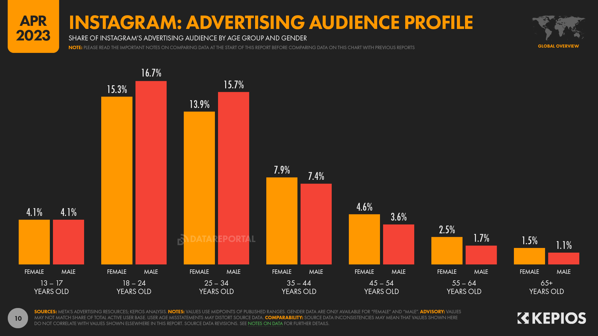

# Instagram
## Основная часть
## 1. Тема и целевая аудитория

**Instagram** - американская социальная сеть для обмена фотографиями и видео.
### Функционал MVP
1. Регистрация и авторизация пользователей
2. Возможность загрузки фотографий, а также применения к ним фильтров
3. Комментирование фотографий другими пользователями
4. Возможность оценки фотографий (лайки)
5. Поиск авторов/пользователей
6. Возможность сохранять понравившиеся посты
7. Лента с постами от подписанных пользователей
8. Подписки на пользователей

### Целевая аудитория

Метрики трафика и вовлеченности
1. MAU - **2B** [^3]
2. DAU - **500M** (по статистике за 2017 год) [^4]
3. Среднее время использования приложения в день - **34 минуты** [^4]
4. Каждый день на платформу загружается **>100M** фотографий [^2]
5. Средняя вовлеченность для постов в Instagram - **0.71%** [^1]

### Распределение аудитории по странам [^9]

### Средний возраст аудитории [^1]

## 2. Рассчет нагрузки
### Предположения
Предположим, что средний пользователь Instagram видит примерно 150 постов в день, при нахождении в приложении **34 минуты** [^4].

В таком случае, при вовлеченности для одного поста в **0.71%** [^1] мы можем посчитать, что в среднем человек оставляет один лайк, комментарий, либо сохраняет один пост в избранное за день.

Также мы можем найти среднее процентное отношение лайков, комментариев и сохранений поста [^6]:

| Лайки | Комментарии | Сохранения |
| --- | --- | --- |
| 93.55% | 2.85% | 3.60% |

Тогда, при MAU в **500M** человек, каждый день оставляется примерно **467.8M** лайков, **14.25M** комментариев, а также **18M** сохранений постов.

### Рассчеты

Из рассчета, что Instagram приводит большинство фотографий к разрешению **1080p x 1080p** [^7], а также сжимает их в целях сохранения места получаем размер одной фотографии примерно в **500KB** [^8].
Тогда, при **100M** загруженных фотографий в день, общий размер хранилища составляет **50TB** в день или **100KB** на пользователя.

Пусть средняя длина комментария - **60** симоволов, тогда в кодировке UTF-8 (для поддрежки большинства языков и emoji) они занимают **0.24KB**. Тогда, при среднем дневном количестве комментариев в **14.25M**,
всего нужно около **3.42GB** в день, или же **0.035KB** на пользователя в день.

### Продуктовые метрики

| Метрика | Значение | 
| --- | --- |
| MAU | **2B** [^3] |
| DAU | **500M** (по статистике за 2017 год) [^4] |
| Среднее время использования приложения в день | **34 минуты** [^4] |
| Каждый день на платформу загружается | **>100M** фотографий [^2] |
| Посещений instagram.com | **7.24B** [^5]|
| Средний размер хранилища для фотографий на пользователя в день | **100KB** |
| Средний размер коментария на пользователя в день | **0.035KB** |
| Среднее количество фотографий на пользователя в день | **0.2шт** |
| Среднее количество комментариев на пользователя в день | **0.03шт** |

### Технические метрики

#### Хранилища

| Тип хранилища | Размер в день | Размер в месяц |
| --- | --- | --- |
| Фотографии | **50TB** | **1.5PB** |
| Комментарии | **3.42GB** | **1TB** |

#### Сетевой трафик

На каждую фотографию кидается запрос на сервер. При примерном количестве постов, которые видит один человек за день в **150**, он в среднем кидает 150 запросов.
Тогда, при DAU в **500M**, каждый день происходит **75B** запросов, или же **3.125B** в час, **52M** в минуту, **868K** в секунду.

Предположим, что к каждому **10-му посту** пользователь прочитает комментарии, и к одному его оставит, либо поставит лайк. При общем количестве этих действий в **15** запросов 
(один запрос на коментарий + **14** на просмотр, так как для нескольких постов пользователь пролистает их вниз, в связи с чем произойдет еще несколько запросов для загрузки 
последующих комментариев),
при DAU в **500M** можем рассчитать дополнительное количество запросов в **7.5B** в день, **87K** в секунду.

Также предположим, что один запрос на получение комментариев возвращает батч на **5 штук**, общим весом в **1KB**.

Из среднего количества загруженных фотографий в день получаем, что в день **100M** запросов на загрузку, **1.2K** в секунду.

| Тип | Средний RPS | Пиковый RPS(*) | Сетевой трафик (средний) | Сетевой трафик (пиковый) |
| --- | --- | --- | --- | --- | 
| Просмотр поста | 868K | 1.7M | 3.4ТБит/с | 6.8ТБит/с |
| Загрузка поста | 1.2K | 2.4K | 4.8ГБит/s | 9.6ГБит/s |
| Открытие секции комментариев | 81K | 162K | 650Mбит/с | 1.2ГБит/с|
| Оставление комментария | 2.8K | 5.6K | 5Мбит/с | 10Мбит/с| 
| Оставление отметки "Нравится" | 2.8K | 5.6K | 22Кбит/c | 44Кбит/с|
| **Итого** | **950K** | **1.9M** | **3.41 ТБит/с**| **6.81ТБит/с** |

(*) Считаем, что пиковый RPS в 2 раза больше среднего.

## 3. Рассчет нагрузки

### Разбиение по доменам

Instagram использует один домен для основных страниц - **instagram.com**, а также некоторые дополнительные, для различных вспомогательных страниц, не рассматриваемых в **MVP** (например, [**help.instagram.com**](https://help.instagram.com)).

### Расположение датацентров

Исходя из данных о странах с самым большим количеством пользователей можем рассчитать следующее расположение датацентров:

1. Азия
   - Индия
        - Мумбаи - Будучи одним из самых населенных городов в Индии, находится рядом с Аравийским морем, что позволит обслуживать не только пользователей из Индии, а также из других ближневосточных стран из-за большого количества оптоволоконных кабелей, подведенных к городу[^10].
    - Сингапур
        - Сингапур - Датацентр в Сингапуре позволит обслужить оставшуюся часть Азии, также являющуюся большой долей пользователей сервиса, в частности Малайзию и Филлипины. Здесь находится настоящий датацентр Meta.
2. Европа
    - Германия
        - Франкфурт - Находясь в самом центре Европы, датацентр здесь способен обеспечить минимальные задержки до большинства стран Еврозоны.
3. Южная Америка
    - Сан-Паулу - Самый населенный город всего континента, размещение датацентра здесь позволит обслужить весь регион.
4. Северная Америка
    - США
        - Калифорния - Датацентр в Сан-Франциско позволяет обслужить всю западную часть США.
        - Техас - 2 датацентра (Хьюстон, Даллас), один будет служить в основном для обслуживания центральной части США, второй будет направлен на работу с центральной Америкой, в частности с Мексикой.
        - Северная Каролина - Шарлотт, обслуживание восточной части США.

Исходя из этих данных, можем построить карту датацентров:

### Используемые технологии
* Для DNS балансировки будет использоваться Geo-based DNS, так как у нас есть несколько датацентров, распаложенных в разных частях мира.

* Для балансировки внтури континента (применимо к США), будет использован AnyCast BGP, позволяющий получить доступ к контенту с минимальными задержками.

## Список использованных источников
[^1]: [Instagram users, stats, data & trends](https://datareportal.com/essential-instagram-stats)

[^2]: [Photo Statistics](https://www.linkedin.com/pulse/impact-instagram-50-statistics-you-should-know-2024-szhue#:~:text=Over%20100%20million%20photos%20and%20videos%20are%20uploaded%20to%20Instagram%20daily.)

[^3]: [Most popular social networks worldwide as of April 2024, by MAU](https://www.statista.com/statistics/272014/global-social-networks-ranked-by-number-of-users/)

[^4]: [BackLinko](https://backlinko.com/instagram-users)

[^5]: [semrush.com](https://www.semrush.com/website/instagram.com/overview/)

[^6]: [Instagram statistics](https://onlysocial.io/important-instagram-statistics/)

[^7]: [Instagram image resolution](https://help.instagram.com/1631821640426723)

[^8]: [Image size calculator](https://toolstud.io/photo/filesize.php?imagewidth=1080&imageheight=1080)

[^9]: [Country-based users distribution](https://www.statista.com/statistics/578364/countries-with-most-instagram-users/)

[^10]: [Submarine Cable Map](https://www.submarinecablemap.com/)